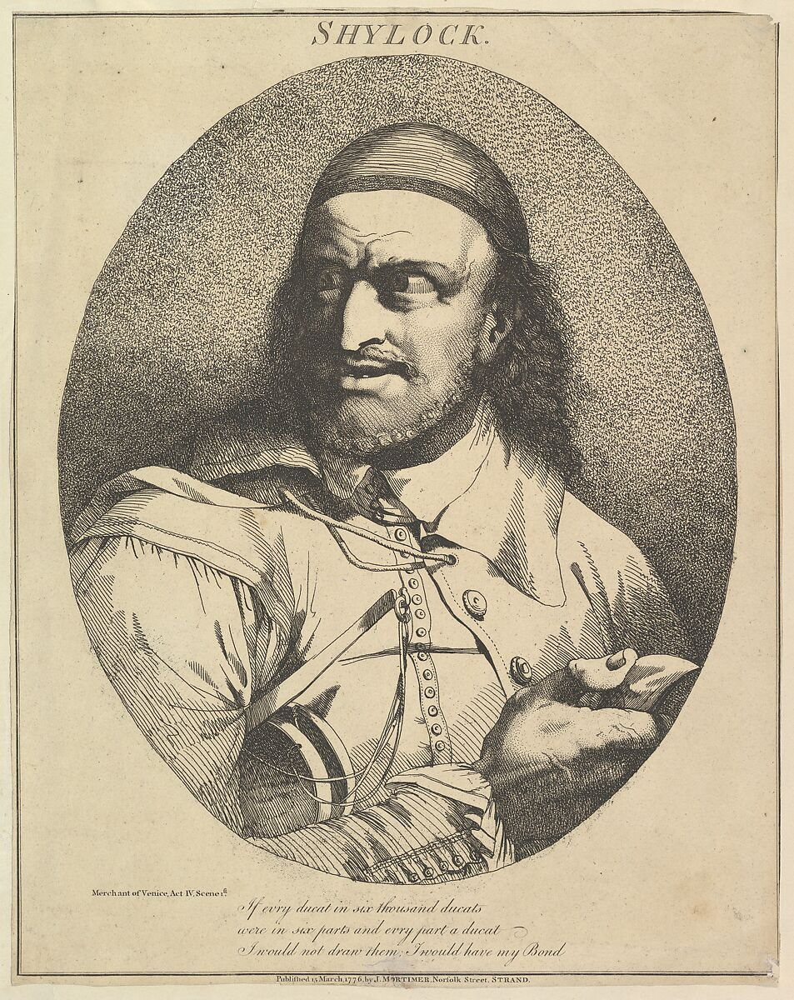
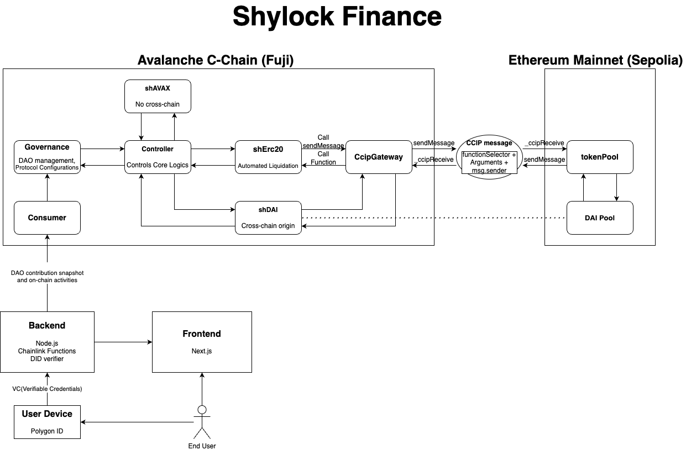

# Shylock Finance

## 1. Introduction

Shylock Finance is an innovative DeFi project designed to facilitate **cross-chain lending and borrowing**. At its core, it leverages the fundamental system of the **Compound Protocol** but stands out with its unique feature: an **under-collateralized loan** system.

This groundbreaking approach allows users to borrow amounts exceeding their collateral value. This is made possible through a comprehensive credit score system, DAO membership, and enhanced KYC procedures using DID technology, ensuring both security and accessibility.

**What is Shylock?**

The name **"Shylock"** is inspired by a character from William Shakespeare's "The Merchant of Venice." Known as a stringent moneylender, Shylock's character is synonymous with strict lending terms. In contrast, Shylock Finance reinterprets this concept for the DeFi world, focusing on innovative and flexible lending solutions. While drawing inspiration from Shylock’s adherence to strict principles, our project diverges by promoting a more equitable and accessible financial ecosystem.

### 1.1. Inspiration

Why can't we get credit in the web3 world? Unsecured loans, like traditional credit, seem too risky on the Web3. We thought that our activities, efforts and reputation on Dao could act as credit. So we came up with a low-collateralized loan that uses Dao's activities as credit and is jointly guaranteed by Dao and the protocol. 

From a user's perspective, it would be a very powerful welfare benefit for Dao, as it would be the only low-collateralized loan they would have to take care of urgent needs.

For Dao, it's a way to reward loyal contributors without minting new tokens. Not only does this satisfy both users and Dao, but it also creates a virtuous cycle as the harder an individual works, the more collateral they can back.

From an LP perspective, the protocol is also very attractive. Since the interest rate is higher than normal due to the low collateral nature of the loan, LPs will see it as a lending protocol where they can get high returns with a little bit of risk. As the liquidity increases, the amount of money available to users and Dao will also increase, so We think this is also a virtuous cycle that will lead to explosive growth.

Ultimately, we want to be the first step in a web3 where activities and positions on Dao will be seen as a profession, where we will be able to get credit for income and jobs on web2.

## 2. Project Overview

### 2.1. Architecture

### 2.2. Tech Stack

- **Frontend**: Next.js, Ethers.js
- **Backend**: Node.js, Express
- **Smart Contract**: Solidity, Foundry
- **Blockchain**: Avalanche C-Chain(Fuji), Ethereum(Sepolia), Polygon(Mumbai)
- **Cross-chain Messaging**: [CCIP(Cross-chain Interoperability Protocol)](https://chain.link/cross-chain)
- **Automated Liquidation**: [Chainlink Automation](https://chain.link/automation)
- **DAO Contribution Tracking**: [Chainlink Functions](https://chain.link/functions)
- **Price Oracle**: [Chainlink Data Feeds](https://data.chain.link/)
- **DID**: [Polygon ID](https://polygonid.com/)

## 3. How It Works

### 3.1. Liquidity Pool

The liquidity pool is a pool of funds that can be borrowed or lent by users. The pool is composed of funds from users and DAO's reserves.

### 3.2. shToken

shToken is a token that represents the amount of funds a user has deposited into the liquidity pool. It inherites the cToken in Compound Protocol. shTokens are minted when a user deposits funds into the pool and burned when a user withdraws funds from the pool.

### 3.3. DAO

DAO is a decentralized autonomous organization that provides its members with more lending capabilities. DAO members can borrow funds from the liquidity pool with less collateral.

User can verify their membership of DAO with DID using Polygon ID. (In development)

### 3.4. Credit Score & DAO score

Credit Score is a score that represents a user's creditworthiness. The credit score is calculated based on the user's transaction history, and the DAO score is calculated based on the user's contribution to the DAO.

These scores are used to determine the amount of funds a user can borrow from the liquidity pool.

### 3.5. KYC with DID

KYC with DID is a system that allows users to verify their identity using DID. This system is used to verify the user's identity when calculating the user's credit score and DAO score.

### 3.6. Cross-chain Messaging

Cross-chain Messaging is a messaging system that allows users to interact with the liquidity pool on different blockchains. This allows users to deposit and borrow funds on different blockchains.

It helps maintain all shTokens in one main chain and not bridging tokens. It is implemented using Chainlink's CCIP.

### 3.7. Automated Liquidation

Automated Liquidation is a system that automatically liquidates a user's collateral when the user's collateral value falls below the required collateral ratio.

It is implemented using Chainlink's Automation.

## 4. Usage

### 4.1. Basic Usage

**Getting Started**:
To start using Shylock Finance, users must first connect their wallet to the platform. Supported wallets include MetaMask, WalletConnect, and others compatible with Avalanche C-Chain, Ethereum Sepolia, and Polygon Mumbai.

**Depositing Funds**:

1. Navigate to the "Deposit" section.
2. Choose the desired blockchain network.
3. Select the amount and type of cryptocurrency to deposit.
4. Approve and confirm the transaction in your wallet.

**Borrowing Funds**:

1. Go to the "Borrow" section.
2. Your available borrowing limit based on your collateral and credit score will be displayed.
3. Select the amount and type of cryptocurrency you wish to borrow.
4. Approve and confirm the transaction.

**Repaying Loans**:

1. Visit the "Repay" section.
2. Choose the loan you wish to repay.
3. Input the repayment amount.
4. Confirm the repayment transaction in your wallet.

### 4.2. Examples

**Example 1 - Deposit and Borrow**:

- Alice wants to deposit 2 ETH into the liquidity pool.
- She navigates to the deposit section, selects ETH, and confirms the transaction.
- Based on her deposit, she is eligible to borrow up to 1.5 ETH worth of different cryptocurrencies.
- She decides to borrow 100 DAI and completes the transaction.

**Example 2 - DAO Membership and Increased Borrowing Limit**:

- Bob is a member of the DAO with a high DAO score.
- He deposits 1 ETH and is eligible to borrow up to 1.25 ETH worth of cryptocurrencies, higher than non-DAO members.
- Bob borrows 150 LINK and agrees to the terms of the loan.

**Example 3 - Automated Liquidation Scenario**:

- Charlie borrows funds against his 3 ETH collateral.
- If the value of ETH drops significantly, causing his collateral ratio to fall below the required threshold, the automated liquidation system is triggered.
- A portion of Charlie’s collateral is sold to bring the loan back into compliance.

**Example 4 - Cross-chain Borrowing**:

- David deposits 1 ETH into the liquidity pool on Avalanche C-Chain Fuji.
- He is eligible to borrow up to 1 ETH worth of cryptocurrencies on Avalanche C-Chain.
- David borrows 100 DAI on Ethereum Sepolia chain.

## 5. Testing & Development

### 5.1. Testing

- Unit Testing @shylock_compound/test/unit

    - ShylockCErc20.t.sol -> Testing the basic functions of the ShylockCompound token
      - testMint
      - testRedeem
      - testAddDaoReserve
      - testWithdrawDaoReserve
      - testAddMemberReserve
      - testWithdrawMemberReserve
      - testBorrow
      - testRepayBorrow
  - ShylockGovernance.t.sol -> Verify that functions that retrieve MemberCap, Reputation, etc. work well with
      - testGetDaoInfo
      - testGetMemberCollateralRate
      - testGetMemberCap
      - testGetMemberReputationInterest
      - testSetDaoCap
      - testSetProtocolToDaoGuaranteeRate
      - testSetDaoTierNumberAndThreshold
      - testSetDaoDataOrigin
      - testSetQuorum
      - testModifyReputation
  - ShylockGovernanceVote.t.sol -> Test the Propose feature of your governance contract
 
- Integration Testing(Deploy Script) @shylock_compound/script
  
    - ShylockDeploy.s.sol -> Deploy and Live deposing Test of Shylock Protocol without Crosschain Functionality
    - ShylockDeployCross.s.sol -> Deploy and Live deposit testing of the Shylock Protocol, including cross-chain functionality.

### 5.2. Contributing

## 6. Roadmap & Future Plans

- [x] **Phase 1**: Basic Features
  - [x] Liquidity Pool
  - [x] shToken
  - [x] DAO
  - [x] Credit Score & DAO score
  - [x] DID
  - [x] Cross-chain Messaging
  - [x] Automated Liquidation
  - [x] Web UI
- [ ] **Phase 2**: Advanced Features
  - [ ] Polygon ZK-EVM Integration
  - [ ] Develop more advanced credit, DAO score system
  - [ ] Develop more advanced liquidation system
  - [ ] Dao verification with Polygon ID

## 7. License

MIT License

See [`LICENSE.md`](LICENSE.md) for details

## 8. Authors & Contact Information

### Sangwon Moon

- Email:
- Github:
- LinkedIn:
- Twitter:
- Telegram:

### Seungmin Jeon

- Email:
- Github:
- LinkedIn:
- Twitter:
- Telegram:

### Wonjae Choi

- Email: [choi@wonj.me](mailto:choi@wonj.me)
- Github: [@wonj1012](github.com/wonj1012)
- LinkedIn: [wonj](https://www.linkedin.com/in/wonj/)
- Twitter: [@0xwonj](https://twitter.com/0xwonj)
- Telegram: [@wonj1012](https://t.me/wonj1012)
